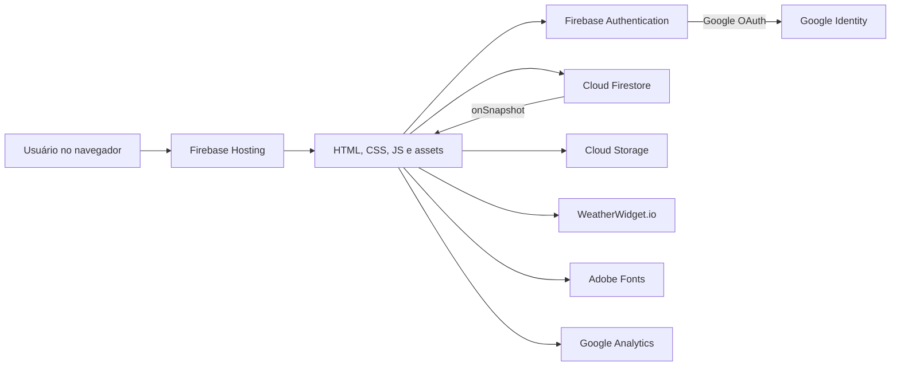
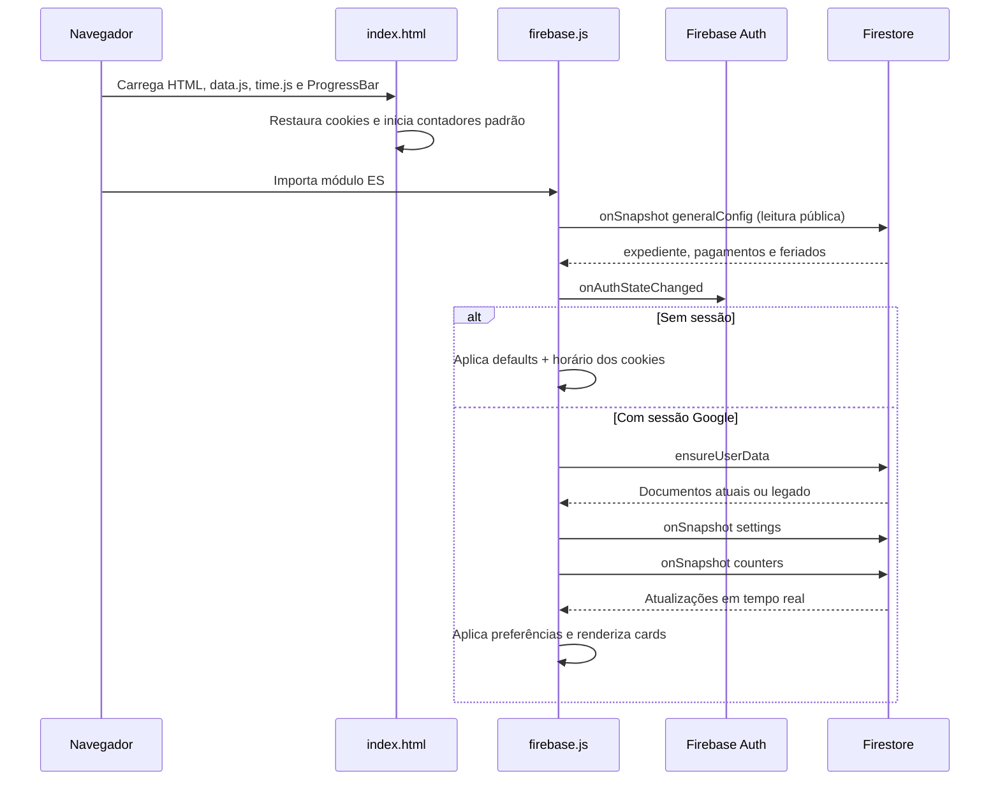
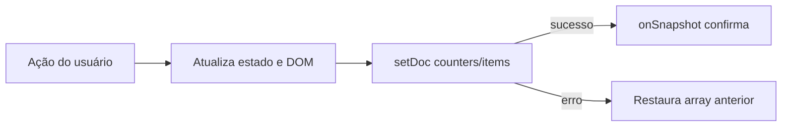

# Arquitetura

## Resumo

O Timekeeper é uma Single Page Application estática, servida pelo Firebase Hosting.
Não existe backend próprio: autenticação e persistência são fornecidas pelo Firebase
diretamente ao navegador, protegidas por regras do Firestore e do Storage.



## Camadas no navegador

### Documento e runtime padrão — `public/index.html`

Responsável por:

- estrutura semântica da página, sidebar e modal;
- três contadores padrão;
- configuração anônima do expediente via cookies;
- instanciação de `ProgressBar.Line`;
- atualização dos contadores padrão a cada segundo;
- tela cheia e carregamento atrasado do widget meteorológico.

Parte do JavaScript de orquestração permanece inline por herança histórica.

### Domínio temporal — `public/src/time.js`

Contém funções puras de intervalo, progresso, períodos fixos e recorrência. Usa um
wrapper compatível com navegador/CommonJS: expõe `TimekeeperTime` no browser e pode
ser importado diretamente pelos testes Node. O módulo Firebase consome a mesma API
por `window`, eliminando duplicação da regra temporal.

### Aplicação autenticada — `public/src/firebase.js`

Responsável por:

- inicializar Firebase Auth, Firestore e Storage;
- autenticar com `GoogleAuthProvider`;
- preparar/migrar documentos do usuário;
- assinar a configuração geral pública e popular seu seed quando um administrador
  encontra a coleção vazia;
- controlar autorização e CRUD do modal administrativo;
- assinar configurações, contadores e metadados de imagens com `onSnapshot`;
- salvar preferências e CRUD de contadores;
- enviar, reutilizar e excluir imagens privadas da biblioteca;
- renderizar cards e lista de gerenciamento;
- aplicar cores e fundos;
- executar canvas da constelação e sincronizar anéis cronológicos.

### Dados de calendário — `public/src/data.js`

Contém os arrays globais de fallback, `expedientePadrao` e
`GENERAL_CONFIG_SEED`. O runtime inline os consome antes de `time.js`/`firebase.js`;
o snapshot de `generalConfig` substitui esses valores em memória quando disponível.

### Apresentação — `public/src/style.css`

Centraliza tokens CSS, superfícies, layouts, breakpoints e animações. O estado
visual é dirigido por atributos no `body`, por exemplo:

```html
<body data-background-enabled="true" data-background-style="constellation">
```

## Bootstrap da aplicação



## Fluxo de escrita

Configurações são gravadas com `setDoc(..., { merge: true })`. Cores e sliders
têm preview no evento `input` e persistem no evento `change`, reduzindo escritas.

Cada data geral é um documento independente. Ao editar a própria data, um batch
remove o ID antigo e grava o novo ID determinístico; o expediente usa o documento
singleton `generalConfig/workday`. As Rules consultam `users/{uid}.isAdmin` antes
de aceitar qualquer escrita nessa coleção.

Contadores são salvos como um único array ordenado, substituindo o documento para
remover campos legados fora da allowlist. Criar/editar aguarda a escrita;
excluir e reordenar são otimistas:



Esse modelo simplifica ordenação e o limite de cinco, mas todo o array é regravado
em cada alteração. Para o volume atual, o custo é pequeno.

## Cálculo temporal

Todos os cálculos usam o relógio e o fuso local do dispositivo.

- `intervalBreakdown`: converte milissegundos em dias, horas, minutos e segundos.
- `resolveCounterState`: delega entre fixo e recorrente.
- `resolveRecurringState`: procura ocorrências em uma janela de -8 a +8 dias.
- `recurringRangeForDate`: move o fim para o dia seguinte quando necessário.
- `periodPercentage`: calcula progresso entre eventos dos arrays estáticos.

O expediente é modelado como recorrência de segunda a sexta, iniciando às 08:00.

## Fronteiras externas

| Integração | Uso | Comportamento sem ela |
| --- | --- | --- |
| Firebase CDN | SDK Auth/Firestore 12.16.0 | Recursos autenticados não inicializam |
| Google OAuth | Login único | Aplicação permanece no modo visitante |
| Firestore | Configuração geral, preferências e contadores | Contadores padrão usam o fallback de `data.js` |
| Cloud Storage | Imagens dos cards pessoais | Cards continuam sem imagem |
| Adobe Fonts | Tipografia | Fallback para `system-ui`/monospace |
| WeatherWidget.io | Previsões | Espaços de clima podem ficar vazios |
| Google Analytics | Métricas | Produto continua funcional |

## Hosting e rotas

O `firebase.json` publica `public/` e reescreve qualquer rota para `index.html`.
Isso dá comportamento SPA, embora o projeto hoje não tenha roteador nem múltiplas
telas. `public/404.html` raramente é alcançado por causa da rewrite global.

## Decisões e trade-offs

### Sem build

Vantagens: implantação simples, poucas dependências e código fácil de inspecionar.
Custos: ausência de hashing de assets, alguma orquestração ainda inline, nenhuma
checagem de tipos e compatibilidade dependente do navegador. Headers de revalidação
reduzem o risco de cache misto enquanto não há hashing.

### Array único de contadores

Vantagens: ordenação natural, leitura única e regra de limite simples. Custos:
concorrência last-write-wins e validação granular mais difícil nas regras.

### Firebase no cliente

Vantagens: autenticação e live updates sem servidor próprio. Custos: segurança
depende integralmente de rules bem testadas; lógica privilegiada não deve existir
no cliente.

## Evoluções arquiteturais recomendadas

1. Extrair o restante do script inline e eliminar dependência de globais.
2. Ampliar os E2E Chromium existentes com regressão visual e uma matriz WebKit/
   Firefox, sem substituir a validação de OAuth em iPhone real.
3. Versionar ou gerar nomes com hash para CSS/JS e usar cache `immutable`.
4. Criar staging Firebase separado de produção.
5. Considerar `signInWithRedirect` como fallback para Safari/WebViews.

## Automação de qualidade

- Node Test Runner cobre cálculos puros e contratos entre HTML/JS/config/docs.
- Playwright cobre visitante, privacidade, Google Auth Emulator, CRUD, imagens,
  persistência e exclusão de conta em desktop/mobile Chromium.
- Firebase Emulator + `@firebase/rules-unit-testing` cobre Firestore e Storage Rules.
- GitHub Actions usa Node 22 e Java 21 em pushes/PRs.
- O teste de calendário falha quando pagamentos/feriados não têm data futura,
  transformando uma manutenção anual em sinal automático da CI.
