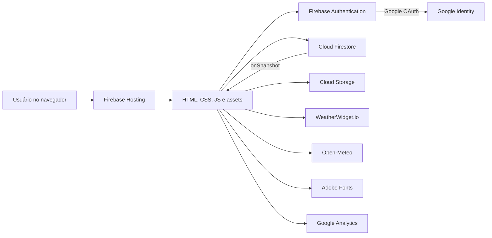
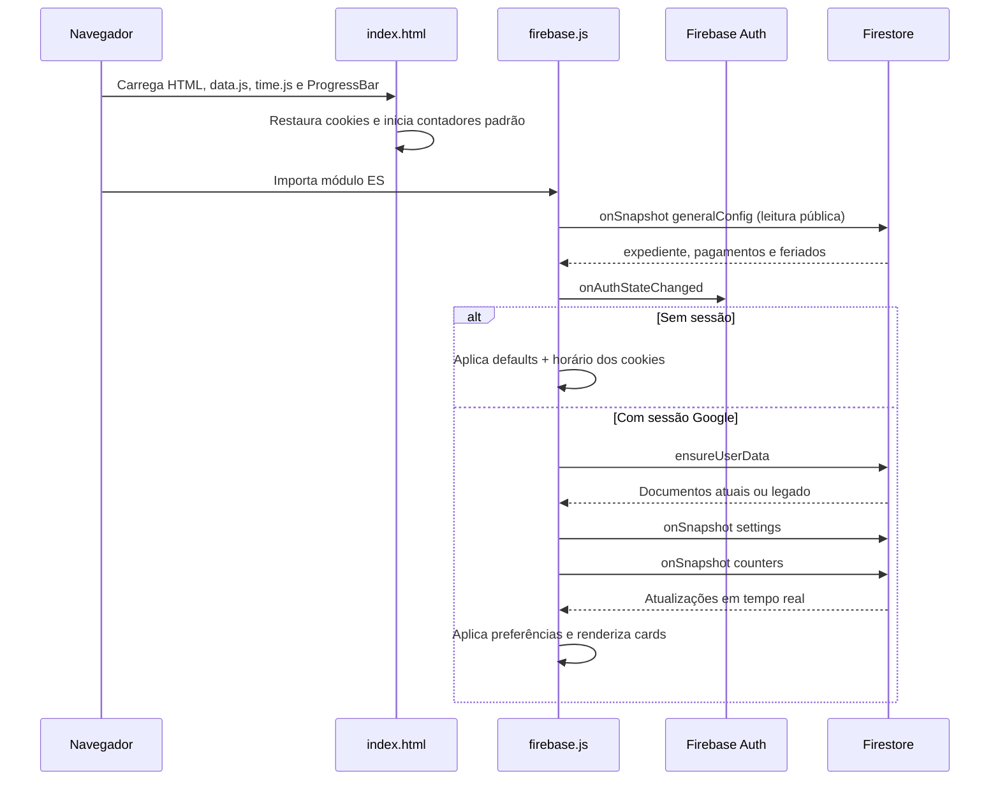
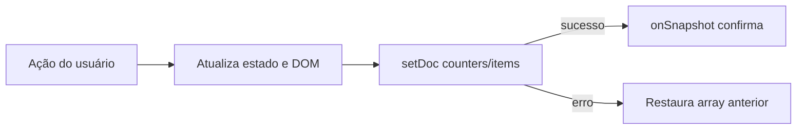

# Arquitetura

## Resumo

O Timekeeper é uma Single Page Application estática, servida pelo Firebase Hosting.
Não existe backend próprio: autenticação e persistência são fornecidas pelo Firebase
diretamente ao navegador, protegidas por regras do Firestore e do Storage.



## Camadas no navegador

### Documento e runtime padrão — `public/index.html`

Responsável por:

- estrutura semântica da página, sidebar e modal;
- três contadores padrão;
- configuração anônima do expediente via cookies;
- instanciação de `ProgressBar.Line`;
- atualização dos contadores padrão a cada segundo;
- tela cheia e carregamento atrasado do widget meteorológico.

Parte do JavaScript de orquestração permanece inline por herança histórica.

### Domínio temporal — `public/src/time.js`

Contém funções puras de intervalo, progresso, períodos fixos e recorrência. Usa um
wrapper compatível com navegador/CommonJS: expõe `TimekeeperTime` no browser e pode
ser importado diretamente pelos testes Node. O módulo Firebase consome a mesma API
por `window`, eliminando duplicação da regra temporal.

### Ocorrências compartilhadas — `public/src/occurrences.js`

Normaliza expediente, calendários e contadores pessoais em ocorrências ordenadas,
com IDs estáveis e limites temporais em milissegundos. Para a Timeline, também
projeta uma escala automática cujo limite é o mais distante entre o próximo marco
de pagamento, feriado e contador pessoal, expandindo os intervalos recorrentes que
cabem nessa escala. O mesmo módulo projeta a grade do mês corrente ou da semana
atual, associa intervalos a todos os dias civis locais que eles atravessam e não
persiste uma cópia. O módulo é puro, funciona no navegador e em CommonJS e continua
sendo a fonte compartilhada pela Timeline, pelo calendário e pelas notificações locais.

### Integração meteorológica — `public/src/weather.js`

Centraliza validação do fornecedor Forecast7, normalização das cidades, estados de
carregamento/erro e carregamento idempotente do script WeatherWidget. Também extrai
as coordenadas codificadas na URL, consulta somente condição atual e dia/noite no
Open-Meteo e mapeia códigos WMO para atmosferas CSS. `IntersectionObserver`, estado
da aba e um intervalo de quinze minutos controlam execução e atualização. Mudanças
de cor ou lista removem iframes e observers antigos sem duplicar scripts ou timers.

### Notificações e push — cliente e Functions

`public/src/notifications.js` normaliza preferências e mantém o fallback local.
`firebase.js` solicita permissão apenas após o toggle explícito, inicializa App Check,
registra a instalação FCM no mesmo service worker e envia o FID por callable. Com o
push ativo, a varredura local é suspensa para evitar duplicidade. Sem configuração
FCM/App Check ou após falha de cadastro, Web Locks e `localStorage` continuam
deduplicando os alertas emitidos enquanto a página está em execução.

`functions/src/push-domain.js` deriva ocorrências no fuso IANA do dispositivo. As
callables de `functions/index.js` cadastram/revogam FIDs privados; a função agendada
assume jobs determinísticos em transação, envia pelo Admin SDK e agrega métricas.

### PWA — `public/src/pwa.js` e `public/sw.js`

O cliente registra o service worker apenas em origem segura ou localhost, oferece
instalação quando o navegador dispara `beforeinstallprompt` e exige ação explícita
para ativar uma versão em espera. O service worker usa network-first em navegações
e stale-while-revalidate somente para assets da própria origem. Firestore, Storage,
fontes e clima externos não são interceptados nem tratados como fonte offline. O
worker recebe mensagens FCM em background e o clique foca ou abre a Timeline.

### Modo de foco — `public/src/focus.js`

Controla a tela imersiva sem duplicar a lógica temporal. O módulo espelha o DOM do
card selecionado a cada segundo, enquanto os runtimes existentes continuam sendo a
fonte dos cálculos e das barras. A preferência usa `sessionStorage`; durante um
reload, um `MutationObserver` aguarda o snapshot que recria um contador pessoal e
abandona com timeout se o ID não existir mais. O fundo ambiente permanece montado,
evitando reinício das animações na entrada e na saída. Em contadores pessoais, a
sincronização também espelha a imagem e as opacidades de imagem/overlay diretamente
das camadas renderizadas pelo cliente.

### Paisagens sonoras — `public/src/soundscapes.js`

O catálogo transforma os assets locais de `public/sounds/` em faixas agrupadas
por categoria e cria um controlador de `HTMLAudioElement` por sessão. O módulo
não chama `play()` durante a inicialização: a faixa só é carregada após uma
seleção e reproduzida por ação explícita. Erros de rede, codec ou permissão
viram o estado `error` para a interface exibir `Indisponível offline`. O modo de
foco pausa o controlador ao fechar, sem adicionar dados ao Firestore. O service
worker pré-carrega somente o módulo; os arquivos de áudio entram no cache
somente quando requisitados.

### Aplicação autenticada — `public/src/firebase.js`

Responsável por:

- inicializar Firebase Auth, Firestore, Storage, Functions, Messaging e App Check;
- autenticar com `GoogleAuthProvider`;
- preparar/migrar documentos do usuário;
- assinar a configuração geral pública e popular seu seed quando um administrador
  encontra a coleção vazia;
- controlar autorização e CRUD do modal administrativo;
- assinar configurações, contadores, arquivo e metadados de imagens com `onSnapshot`;
- salvar preferências e CRUD de contadores;
- enviar, reutilizar e excluir imagens privadas da biblioteca;
- renderizar cards e lista de gerenciamento;
- aplicar cores e fundos;
- renderizar Timeline linear, calendário e central de notificações local/push;
- criar os cards pessoais com ações e IDs estáveis consumidos pelo modo de foco;
- executar canvas da constelação, sincronizar anéis cronológicos e coordenar o
  runtime WebGL.
- gerar/copiar links públicos, preservar `isPublic` na normalização e abrir a rota
  profunda diretamente no Modo de Foco depois que a callable retorna o contador.

### Links públicos — cliente, Hosting e Functions

As rotas `/p/u/{uid}/c/{counterId}` e `/p/t/{teamId}/c/{counterId}` recebem
`index.html` pela rewrite do Hosting. O `<base href="/">` mantém CSS, scripts,
manifesto e ícones apontando para a raiz mesmo em URLs profundas. O cliente chama
`getPublicCounterData`; a Function consulta a subcoleção atual
`users/{uid}/counters` ou `teams/{teamId}/counters` pelo ID lógico e só devolve o
documento quando `isPublic == true`. O agregado legado `data/counters` não participa
desse fluxo.

### Fundos WebGL — `public/src/background-webgl.js`

Compila um programa WebGL compartilhado e seleciona um dos cinco fragmentos
procedurais por uniforme. O módulo limita resolução, recebe cores, velocidade e
intensidade normalizadas de `firebase.js`, pausa o frame loop fora da tela e mantém
uma cena estática quando o sistema solicita movimento reduzido.

### Dados de calendário — `public/src/data.js`

Contém os arrays globais de fallback, `expedientePadrao` e
`GENERAL_CONFIG_SEED`. O runtime inline os consome antes de `time.js`/`firebase.js`;
o snapshot de `generalConfig` substitui esses valores em memória quando disponível.

### Apresentação — `public/src/style.css`

Centraliza tokens CSS, superfícies, layouts, breakpoints e animações. O estado
visual é dirigido por atributos no `body`, por exemplo:

```html
<body data-background-enabled="true" data-background-style="constellation">
```

As seções operacionais usam `data-dashboard-section` com os IDs estáveis
`standard`, `custom`, `timeline` e `weather`. Preferências passam por normalização
central no cliente antes de afetar ordem ou visibilidade.

## Bootstrap da aplicação



## Fluxo de escrita

Configurações são gravadas com `setDoc(..., { merge: true })`. Cores e sliders
têm preview no evento `input` e persistem no evento `change`, reduzindo escritas.

Cada data geral é um documento independente. Ao editar a própria data, um batch
remove o ID antigo e grava o novo ID determinístico; o expediente usa o documento
singleton `generalConfig/workday`. As Rules consultam `users/{uid}.isAdmin` antes
de aceitar qualquer escrita nessa coleção.

Contadores são salvos como um único array ordenado, substituindo o documento para
remover campos legados fora da allowlist. Criar/editar aguarda a escrita;
excluir e reordenar são otimistas:



Esse modelo simplifica ordenação e o limite de cinco, mas todo o array é regravado
em cada alteração. Para o volume atual, o custo é pequeno.

O arquivamento é uma exceção intencional ao fluxo otimista: após confirmação do
usuário, uma transação lê as versões atuais, remove o contador fixo de `counters` e
o insere no início de `archive` com `archivedAt`. A UI aguarda o `onSnapshot` dos
dois documentos, evitando apresentar uma vaga livre antes de o movimento atômico
ter sido aceito. A exclusão de uma conquista também usa transação.

## Cálculo temporal

Todos os cálculos usam o relógio e o fuso local do dispositivo.

- `intervalBreakdown`: converte milissegundos em dias, horas, minutos e segundos.
- `resolveCounterState`: delega entre fixo e recorrente.
- `resolveRecurringState`: procura ocorrências em uma janela de -8 a +8 dias.
- `recurringRangeForDate`: move o fim para o dia seguinte quando necessário.
- `periodPercentage`: calcula progresso entre eventos dos arrays estáticos.

O expediente é modelado como recorrência de segunda a sexta, iniciando às 08:00.

## Fronteiras externas

| Integração | Uso | Comportamento sem ela |
| --- | --- | --- |
| Firebase CDN | SDK Auth/Firestore 12.16.0 | Recursos autenticados não inicializam |
| Google OAuth | Login único | Aplicação permanece no modo visitante |
| Firestore | Configuração geral, preferências e contadores | Contadores padrão usam o fallback de `data.js` |
| Cloud Storage | Imagens dos cards pessoais | Cards continuam sem imagem |
| Adobe Fonts | Tipografia | Fallback para `system-ui`/monospace |
| WeatherWidget.io | Previsões | Espaços de clima podem ficar vazios |
| Open-Meteo | Condição atual das atmosferas | Widget permanece neutro |
| Google Analytics | Métricas | Produto continua funcional |

## Hosting e rotas

O `firebase.json` publica `public/` e reescreve qualquer rota para `index.html`.
Isso dá comportamento SPA e permite os links públicos `/p/...`; o cliente reconhece
essas rotas sem introduzir um roteador. `public/404.html` raramente é alcançado por
causa da rewrite global.

## Decisões e trade-offs

### Sem build

Vantagens: implantação simples, poucas dependências e código fácil de inspecionar.
Custos: ausência de hashing de assets, alguma orquestração ainda inline, nenhuma
checagem de tipos e compatibilidade dependente do navegador. Headers de revalidação
reduzem o risco de cache misto enquanto não há hashing.

### Array único de contadores

Vantagens: ordenação natural, leitura única e regra de limite simples. Custos:
concorrência last-write-wins e validação granular mais difícil nas regras.

### Firebase no cliente

Vantagens: autenticação e live updates sem servidor próprio. Custos: segurança
depende integralmente de rules bem testadas; lógica privilegiada não deve existir
no cliente.

## Evoluções arquiteturais recomendadas

1. Extrair o restante do script inline e eliminar dependência de globais.
2. Ampliar os E2E Chromium existentes com regressão visual e uma matriz WebKit/
   Firefox, sem substituir a validação de OAuth em iPhone real.
3. Versionar ou gerar nomes com hash para CSS/JS e usar cache `immutable`.
4. Criar staging Firebase separado de produção.
5. Considerar `signInWithRedirect` como fallback para Safari/WebViews.
6. Particionar o scheduler por shard antes de ultrapassar 200 dispositivos ativos.

## Automação de qualidade

- Node Test Runner cobre cálculos puros do cliente, domínio das Functions e
  contratos entre HTML/JS/config/docs.
- Playwright cobre visitante, privacidade, Google Auth Emulator, CRUD, imagens,
  persistência e exclusão de conta em desktop/mobile Chromium.
- Firebase Emulator + `@firebase/rules-unit-testing` cobre Firestore e Storage Rules.
- GitHub Actions usa Node 22 e Java 21 em pushes/PRs.
- O teste de calendário falha quando pagamentos/feriados não têm data futura,
  transformando uma manutenção anual em sinal automático da CI.
